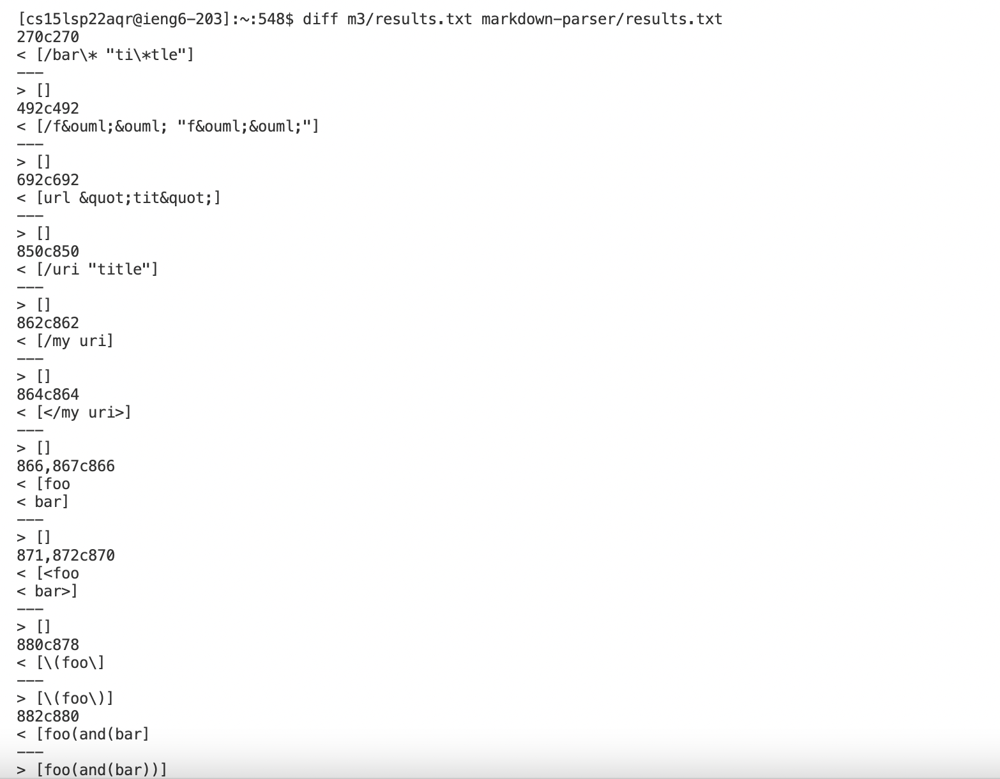
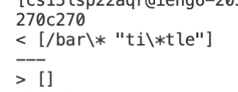
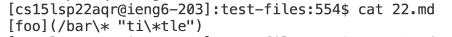
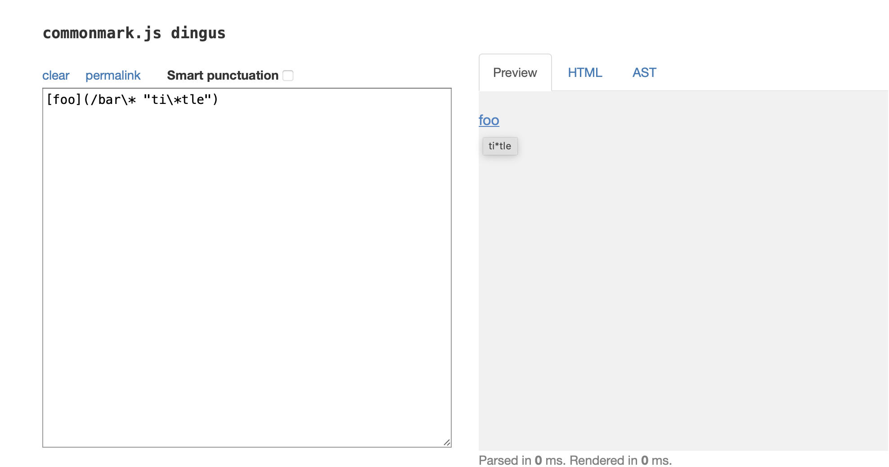
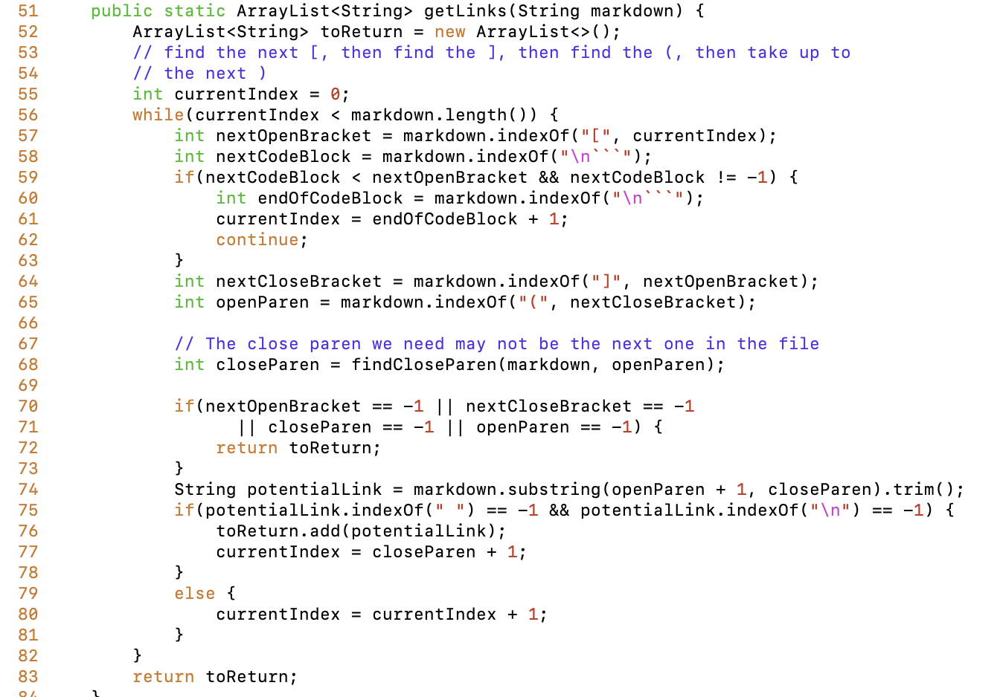
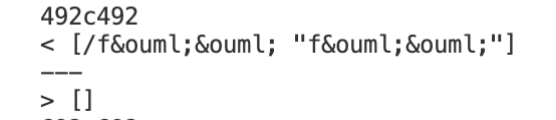
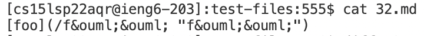
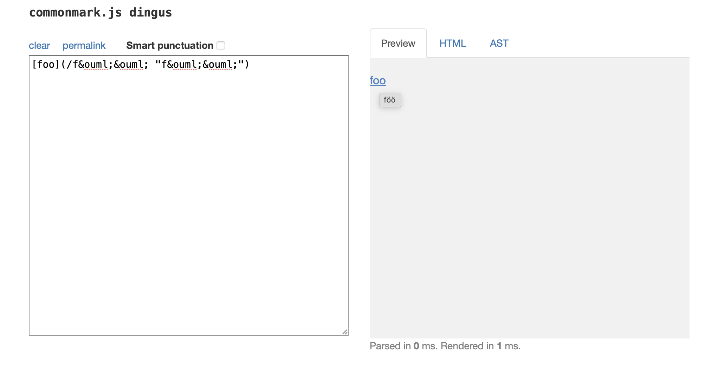

# Name : Shaodong Shan
# Course: CSE 15L Lab 5
>Date: June 1, 2022
>
>This is my fifth lab report, welcome.
>

>
# Choose TWO tests from the 652 tests in result.txt files
> By using the remote account in the terminal of my VScode, I used the command `diff` to compare the results that we get from running the `bash script.sh` on the both of those implementations.
> By log in with `ssh ieng6`, we can access the remote service, and we can use the following command to run it in terminal.

___
```
diff m3/results.txt markdown-parser/results.txt"
```

> I renamed my own implementation `markdown-parser` to `m3`.
> And I cloned professor implementation `markdown-parser`.
> Here is the output after I run the command to compare them in my terminal.




# Test 1.

> As shown in the screenshot below, we can see the difference of actual output is existing in line 270.


> As shown in the screenshot below, we can find the testing correspond to the markdown file: 


>Link to the markdown file
>
>[links md file](https://github.com/nidhidhamnani/markdown-parser/blob/main/test-files/22.md)
>
> We can use the command `cat` to check the content in the 22.md line.


> The expecting output by using [the CommonMark demo site](https://spec.commonmark.org/dingus/).

>

>
# Test 2.

> As shown in the screenshot below, we can see the difference of actual output is existing in line 492.


> As shown in the screenshot below, we can find the testing correspond to the markdown file: 


> Link to the makedown file
> 
> [link md file](https://github.com/nidhidhamnani/markdown-parser/blob/main/test-files/32.md)
> 
> We can use the command `cat` to check the content in the 32.md line.


> The expecting output by using [the CommonMark demo site](https://spec.commonmark.org/dingus/).

>

